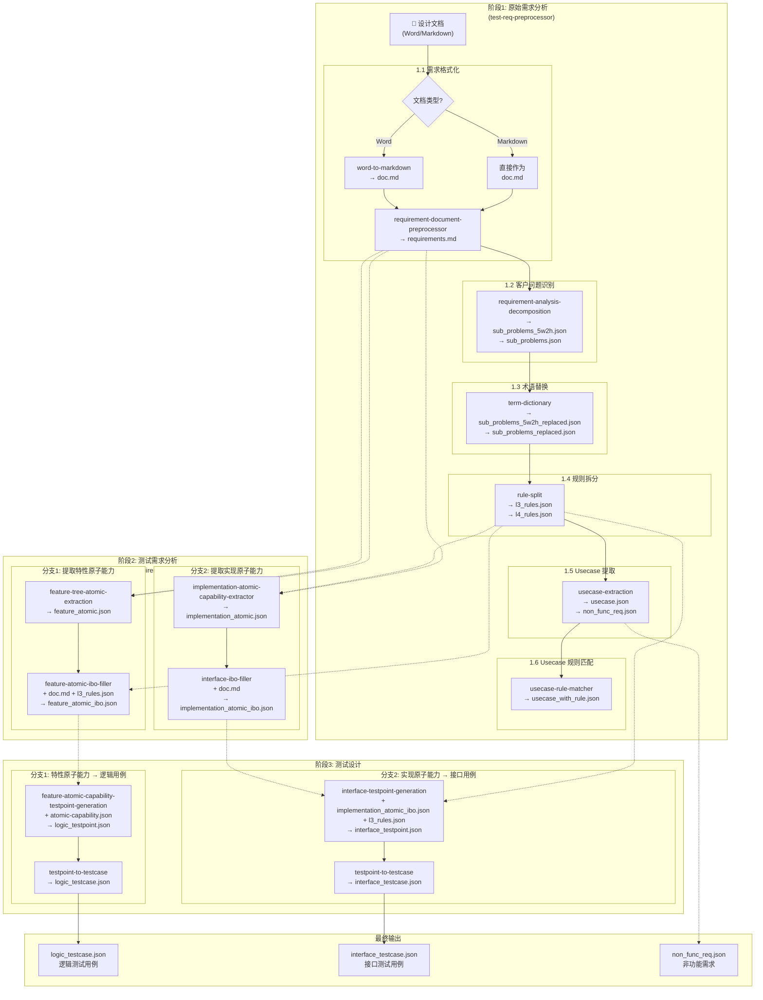

# 测试用例生成流程

## 流程概览

## 阶段说明

### 阶段1: 原始需求分析

**执行者:** `test-req-preprocessor`

| 步骤 | Skill | 输入 | 输出 |
|-----|-------|------|------|
| 1.1 | word-to-markdown + requirement-document-preprocessor | 设计文档 | requirements.md |
| 1.2 | requirement-analysis-decomposition | requirements.md | sub_problems_5w2h.json, sub_problems.json |
| 1.3 | term-dictionary | sub_problems_5w2h.json, sub_problems.json | sub_problems_5w2h_replaced.json, sub_problems_replaced.json |
| 1.4 | rule-split | sub_problems_5w2h_replaced.json | l3_rules.json, l4_rules.json |
| 1.5 | usecase-extraction | sub_problems_5w2h_replaced.json | usecase.json, non_func_req.json |
| 1.6 | usecase-rule-matcher | usecase.json, rules.json | usecase_with_rule.json |

### 阶段2: 测试需求分析

**执行者:** `test-requirement-analyst`

| 分支 | Skill | 输入 | 输出 |
|-----|-------|------|------|
| 分支1.1 | feature-tree-atomic-extraction | doc.md | feature_atomic.json |
| 分支1.2 | feature-atomic-ibo-filler | feature_atomic.json, doc.md, l3_rules.json | feature_atomic_ibo.json |
| 分支2.1 | implementation-atomic-capability-extractor | doc.md | implementation_atomic.json |
| 分支2.2 | interface-ibo-filler | doc.md, implementation_atomic.json | implementation_atomic_ibo.json |

**注意:** 分支1和分支2可同时执行

### 阶段3: 测试设计

**执行者:** `test-design-expert`

| 分支 | Skill | 输入 | 输出 |
|-----|-------|------|------|
| 分支1.1 | feature-atomic-capability-testpoint-generation | atomic-capability.json | logic_testpoint.json |
| 分支1.2 | testpoint-to-testcase | logic_testpoint.json | logic_testcase.json |
| 分支2.1 | interface-testpoint-generation | implementation_atomic_ibo.json, l3_rules.json | interface_testpoint.json |
| 分支2.2 | testpoint-to-testcase | interface_testpoint.json | interface_testcase.json |

**注意:** 分支1和分支2可同时执行

## 最终输出产物

| 文件 | 说明 |
|------|------|
| logic_testcase.json | 基于特性原子能力生成的逻辑测试用例 |
| interface_testcase.json | 基于实现原子能力生成的接口测试用例 |
| non_func_req.json | 从需求中提取的非功能性需求 |
